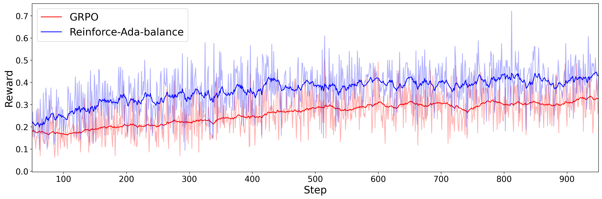

<div align="center">

# Reinforce-Ada: An Adaptive Sampling Framework for Reinforce-Style LLM Training
[](https://arxiv.org/abs/2510.04996) 
[](https://github.com/RLHFlow/Reinforce-Ada)
[](https://github.com/RLHFlow/Reinforce-Ada-Tinker)
</div>

## 🛠️ Reinforce-Ada on Tinker
All results shown in our paper are from the runnings on verl. Here we further validate the effectiveness of Reinforce-Ada on another easy-to-use training API, [Tinker](https://github.com/thinking-machines-lab/tinker).

<p align="center">
  
</p>

<i><b>Figure 3:</b> Training dynamics with Qwen3-4B-Instruct-2507.</i>
</p>

We can observe that Reinforce-Ada achieves a significantly higher reward (from iid samples w/o adaptive sampling) than GRPO on Tinker with LoRA finetuning.

### Note:
1. We apply full finetuning in our paper, while Tinker only supports finetuning with LoRA. The above results from LoRA are slightly worse than full finetuning on verl, which might be able to improve by adjusting the LoRA rank and learning rate. 
2. For full finetuning, we utilizes a small lr=1e-6. This small lr makes the learning really slow with LoRA. [Tinker suggests](https://tinker-docs.thinkingmachines.ai/supervised-learning/sl-hyperparams) using a 40 times lr (i.e. lr=4e-5) for LoRA on Qwen3-4B-Instruct-2507, which results in reward collapse (increase first, then decrease to 0) for both GRPO and Reinforce-Ada. Here we set lr=5e-6. A dedicated tuning might result in better performance.


## 🌍 Environment Setup
1. Create a new environment.
   ```bash
   python -m venv ~/.python/reinforce_ada_tinker
   source ~/.python/reinforce_ada/bin/activate

   # You can also use conda 
   #conda create -n reinforce_ada_tinker python==3.10
   #conda activate reinforce_ada_tinker
   ```
2. Install dependencies
   ```bash
   pip install pip --upgrade
   pip install uv
   python -m uv pip install tinker
   git clone https://github.com/RLHFlow/Reinforce-Ada-Tinker
   cd Reinforce-Ada-Tinker
   python -m uv pip install -e .
   python -m uv pip install wandb
   ```

## 🧪 Experiment Running
1. Prepare the training and test datasets

    If you have custom dataset, or want to train a new LLM, please go to the [Reinforce-Ada verl version]((https://github.com/RLHFlow/Reinforce-Ada)) for this step. Otherwise, you can use our open-sourced training sets in the following.
2. Start the training

   ```bash
   # Set your key in this file
   bash scripts/run_reinforce_ada.sh
   ```

   The key hyperparameters from Reinforce-Ada are:
   - ``multiround_adaptive_downsampling=True``: Use adaptive sampling.
   - ``reinforce_ada_choice=balanced``: How to balance the positive and negative prompts within a batch, could be one of [balanced, positive-focused].
   - ``global_stat_est=True``: Use global statistics to calculate the mean and std.

   Note: Tinker considers one update of the actor as a step, while verl consider one update of the reference model as a step. total_steps, max_steps_off_policy and groups_per_batch has been set accordingly to match the verl version for training 400 steps.

3. Evaluate
   
   We don't offer the evaluation code with Tinker. It's suggested to [download the weights](https://tinker-docs.thinkingmachines.ai/download-weights) and evaluate them with our [Reinforce-Ada verl version]((https://github.com/RLHFlow/Reinforce-Ada)). You can evaluate the checkpoint every 800 steps with Tinker.


## 📢 Introduction
This repository contains the official implementation for Reinforce-Ada with [Tinker](https://github.com/thinking-machines-lab/tinker), an adaptive sampling framework designed to resolve the ``signal collapse'' problem in Reinforce-style algorithm with group baselines such as GRPO, making training more efficient and effective.


### 🧐 The Challenge: Signal Collapse in GRPO
Group Relative Policy Optimization (GRPO) is a widely used algorithm in Reinforcement Learning from Verifiable Reward (RLVR). It calculates the advantage by normalizing rewards within a group of n responses:
$$g_\theta(x,a) =  \frac{r_i - \bar{r}}{\sigma_r + \varepsilon} \cdot \nabla_\theta \log \pi_\theta(a|x).$$

While effective, GRPO suffers from a critical flaw in practice: **signal collapse**. When all n samples for a prompt yield the same reward (e.g., all correct or all incorrect), **the gradient is zero** for all the responses and there is no learning signal for this prompt.


<p align="center">
  
</p>
<i><b>Figure 1:</b> The proportion of prompts with zero gradient (uniform rewards) remains high during training.</i>

This isn't a minor issue. It frequently occurs early in training (when models fail on hard prompts) and later in training (when models master easy ones). Crucially, this is a **statistical artifact of undersampling**, not a sign that the prompts are useless. A larger sample size n would often reveal a mix of correct and incorrect answers, unlocking a valid learning signal. For instance, the RL trained model exhibits 35.3\% all-correct groups at n=4, but only 10.2\% at n=256. These results demonstrate that the missing signal is often recoverable with larger n, confirming that uniform-reward collapse is a sampling artifact rather than a model limitation.  

<p align="center">
  
</p>

<i><b>Figure 2:</b> Increasing sample size (pass@k) reveals the model's true capability, confirming that signals are often recoverable.</i>
</p>

However, uniformly increasing n for all prompts is computationally prohibitive. Seminal works like DeepSeek-R1 show that a small group size (e.g., n=16) is sufficient for an effective gradient update. This reveals a gap between the large inference budget needed to find a signal and the smaller update budget needed to learn from it.


### ✨ Our Solution Reinforce-Ada: Reinforce with Adaptive Sampling
To bridge this gap, we introduce Reinforce-Ada, an adaptive sampling framework that intelligently allocates the inference budget. Instead of a fixed n, our algorithm samples in rounds, deactivating prompts once a sufficient learning signal is found. This frees up computation, allowing difficult prompts to be sampled more deeply until a useful signal emerges.


<p align="center">
  
</p>

<i><b>Algorithm 1:</b> The Reinforce-Ada framework.</i>
</p>

Our framework consists of three core ideas:

1. **Adaptive Sampling**: A successive elimination process that eliminates prompts with sufficient learning signals and keeps sampling the unsolved prompts.
2. **Principled Exit Conditions**: Flexible rules (Reinforce-Ada-pos, Reinforce-Ada-balance) to determine when a prompt is resolved, balancing signal diversity and sampling efficiency.
3. **Robust Advantage Calculation**: We compute the advantage baseline $(r_i-\bar{r})$ using statistics from the entire pool of responses generated for a prompt, not just the final down-sampled batch, leading to more stable estimates.


## 🤗 Processed Training Sets
We offer the processed/selected training prompts in [huggingface](https://huggingface.co/collections/RLHFlow/reinforce-ada-68e3a8a10fc69dc56d9d86fe).

Note: Not all LLMs are supported by Tinker, you can check the supported models [here](https://github.com/thinking-machines-lab/tinker-cookbook/blob/main/tinker_cookbook/model_info.py). 

  | Model to train | Prompt level | Algorithm | Training set |
  | --- | --- | --- | --- | 
  | ```Qwen/Qwen2.5-Math-1.5B``` | easy | Reinforce-Ada-balance | [```RLHFlow/reinforce_ada_easy_prompt_1.5b```](https://huggingface.co/datasets/RLHFlow/reinforce_ada_simple_prompt_1-5b) 
  | ```Qwen/Qwen2.5-Math-1.5B``` | hard | Reinforce-Ada-balance | [```RLHFlow/reinforce_ada_hard_prompt_1.5b```](https://huggingface.co/datasets/RLHFlow/reinforce_ada_hard_prompt_1-5b)
  | ```Qwen/Qwen2.5-Math-7B``` | easy | Reinforce-Ada-balance | [```RLHFlow/reinforce_ada_easy_prompt```](https://huggingface.co/datasets/RLHFlow/reinforce_ada_easy_prompt) 
  | ```Qwen/Qwen2.5-Math-7B``` | hard | Reinforce-Ada-balance | [```RLHFlow/reinforce_ada_hard_prompt```](https://huggingface.co/datasets/RLHFlow/reinforce_ada_hard_prompt) 
  | ```Qwen/Qwen3-4B-Instruct-2507``` | hard | Reinforce-Ada-balance | [```RLHFlow/reinforce_ada_hard_prompt```](https://huggingface.co/datasets/RLHFlow/reinforce_ada_hard_prompt)
  | ```meta-llama/Llama-3.2-3B-Instruct``` | hard | Reinforce-Ada-balance | [```RLHFlow/reinforce_ada_hard_prompt_llama```](https://huggingface.co/datasets/RLHFlow/reinforce_ada_hard_prompt_llama) 


## 🙏 Acknowledgement
We thank [Tinker](https://github.com/thinking-machines-lab/tinker) for providing theis awesome training API.

## 📝 Citation
If you find our paper or code helpful, feel free to give us a citation.
```bibtex
@misc{xiong2025reinforceada,
      title={Reinforce-Ada: An Adaptive Sampling Framework for Reinforce-Style LLM Training}, 
      author={Wei Xiong and Chenlu Ye and Baohao Liao and Hanze Dong and Xinxing Xu and Christof Monz and Jiang Bian and Nan Jiang and Tong Zhang},
      year={2025},
      eprint={2510.04996},
      archivePrefix={arXiv},
      primaryClass={cs.LG},
      url={https://arxiv.org/abs/2510.04996}, 
}
```
